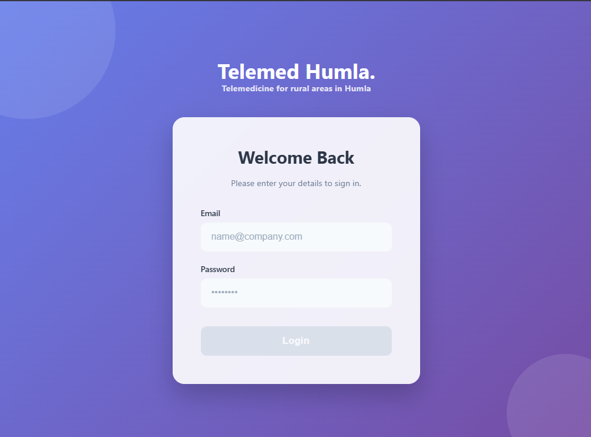
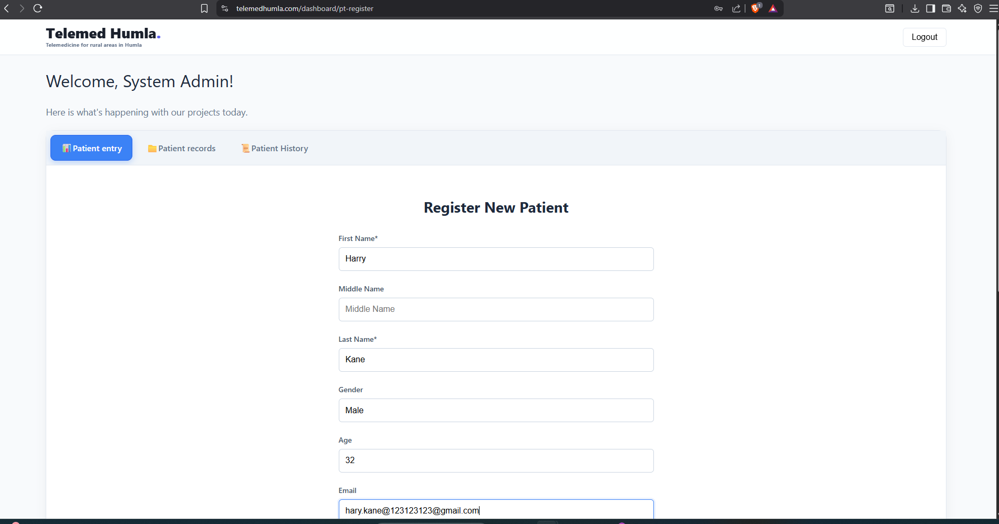
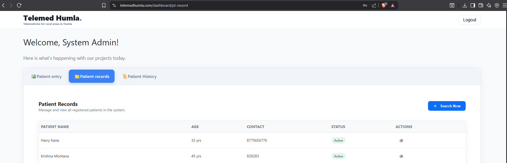
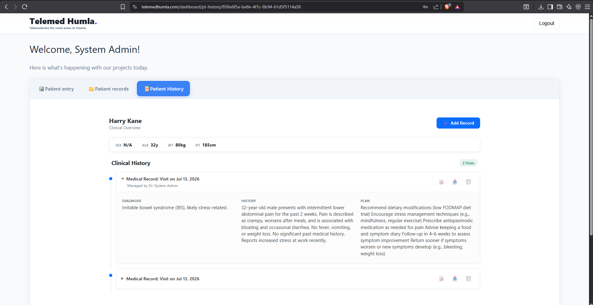
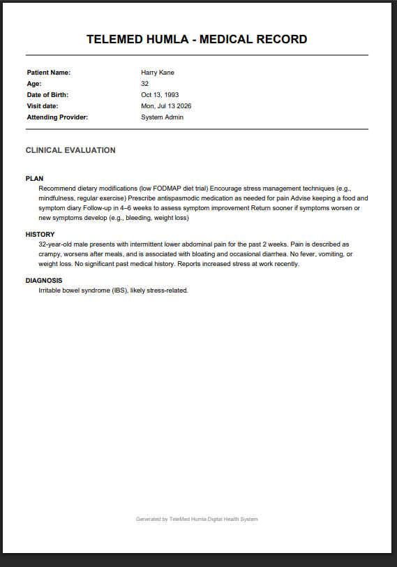
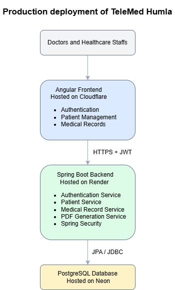

# telemed-humla

> A full-stack telemedicine platform built to support healthcare providers delivering remote consultations and patient 
> care in rural Nepal.

**Live Application:** https://telemedhumla.com

---

## Real-World Impact

TeleMed Humla was designed and developed to support doctors and healthcare workers providing medical services in remote 
regions of Nepal where access to healthcare infrastructure is limited.

The platform streamlines patient registration, consultation management, medical record keeping, and document generation
through a secure cloud-hosted web application.

This project was independently designed, developed, deployed, and maintained from end to end.

---

## Screenshots

### Login & Authentication



---

### Patient Registration



---

### Ptient Records



---

### Ptient History



---

### PDF Record Generation



---

## System Architecture




---

## Key Features

### Patient Management

* Register and manage patient records
* Search and retrieve patient information
* Maintain complete patient history
* Update demographic and clinical information

### Telemedicine Workflow

* Record consultations
* Document diagnoses and treatments
* Track historical visits
* Generate medical documentation

### Security & Access Control

* JWT authentication
* Refresh token support
* Password encryption
* Role-based authorization
* Protected API endpoints

### Data Management

* Structured healthcare records
* Validation and error handling
* Database versioning and migrations
* Audit-friendly data model

---

## Technology Stack

### Frontend

* Angular
* TypeScript
* Reactive Forms
* Angular Router
* HTTP Interceptors

### Backend

* Java 17
* Spring Boot
* Spring Security
* Spring Data JPA
* JWT Authentication
* Flyway
* Maven

### Database

* PostgreSQL
* Neon Serverless Database

### Infrastructure

* Cloudflare
* Render
* Docker
* GitHub

---

## Architecture & Design

The backend follows a layered architecture to promote maintainability, testability, and separation of concerns.

```text
Controllers
    │
Services
    │
Repositories
    │
PostgreSQL
```

Major modules include:

* Authentication Service
* User Management
* Patient Management
* Medical Record Management
* PDF Generation Service
* Security Layer

---

## Security

Healthcare applications require careful handling of sensitive information.

Implemented security measures include:

* JWT-based authentication
* Refresh token management
* Password hashing
* Role-based access control
* API endpoint protection
* Centralized exception handling
* Input validation
* Request logging

---

## Database

PostgreSQL serves as the primary datastore with Neon providing managed cloud infrastructure.

Database schema changes are managed through Flyway migrations, ensuring reproducible deployments and version-controlled database evolution.

Core entities include:

* Users
* Roles
* Patients
* Medical Records
* Refresh Tokens

---

## Deployment

### Production Environment

#### Frontend

* Hosted on Cloudflare
* Global CDN delivery
* Custom domain configuration

#### Backend

* Spring Boot application deployed on Render
* Docker-based deployment pipeline

#### Database

* PostgreSQL hosted on Neon

---

## Local Development

### Backend

Requirements:

* Java 17+
* Maven
* PostgreSQL

```bash
./mvnw spring-boot:run
```

### Frontend

Requirements:

* Node.js
* npm

```bash
npm install
npm start
```

---

## Engineering Highlights

This project demonstrates:

* Full-stack software development
* Secure REST API design
* Cloud-native deployment
* Authentication and authorization
* Database design and migrations
* Production infrastructure management
* End-to-end product ownership

---

## Challenges Solved

* Designed a low-cost deployment architecture suitable for a non-profit healthcare environment.
* Built a secure patient record management system for remote healthcare workflows.
* Implemented cloud-hosted infrastructure with minimal operational overhead.
* Delivered a complete production-ready application as a solo developer.

---

## Future Enhancements

* Appointment scheduling
* SMS notifications
* Offline-first support for low-connectivity regions
* Multi-language support (English/Nepali)
* Teleconsultation video integration
* Reporting and analytics dashboard

---

## Author

Developed independently by a software engineer with ownership of:

* Requirements gathering
* System architecture
* Frontend development
* Backend development
* Database design
* Security implementation
* Cloud deployment
* Production maintenance
